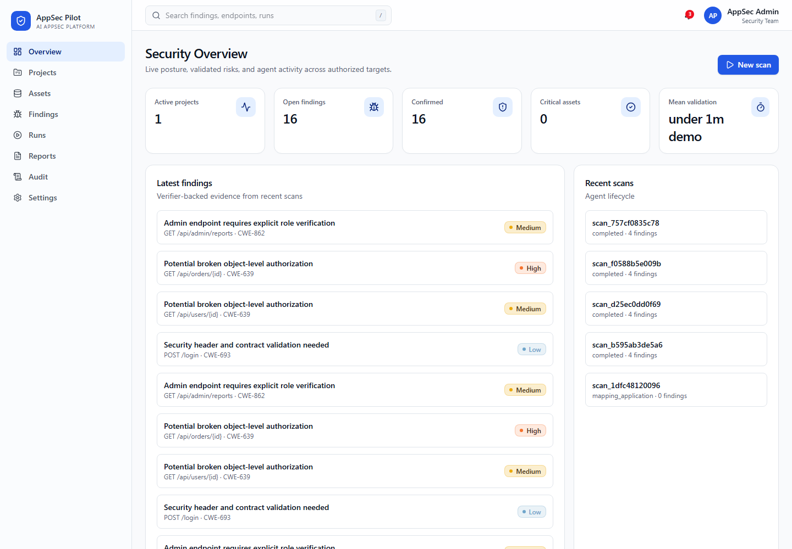
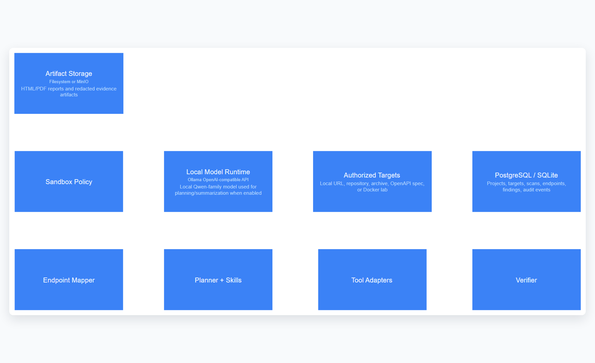
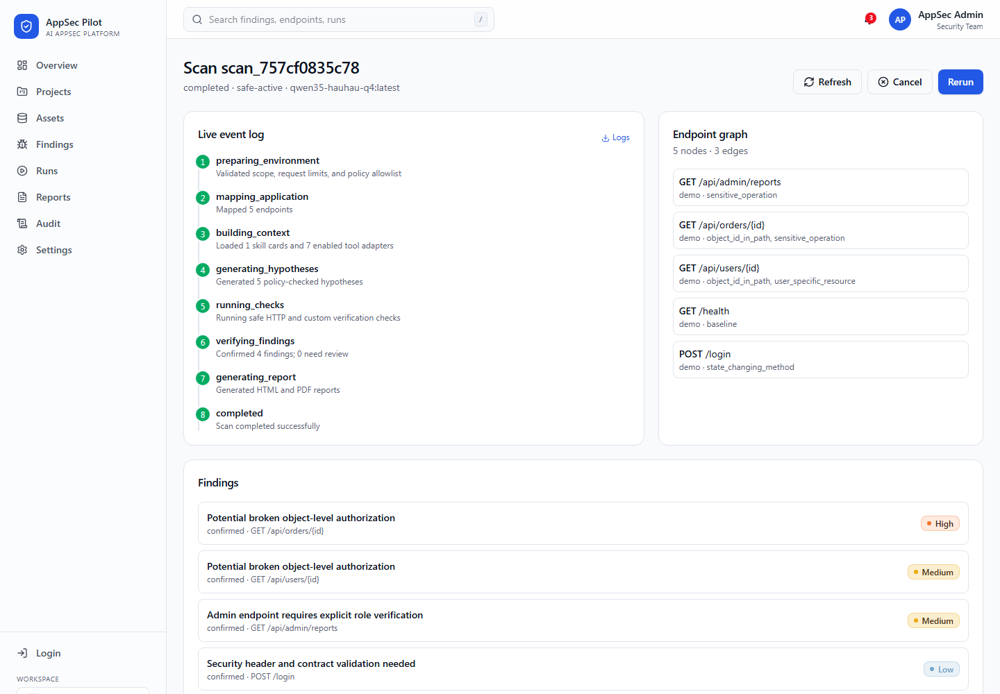
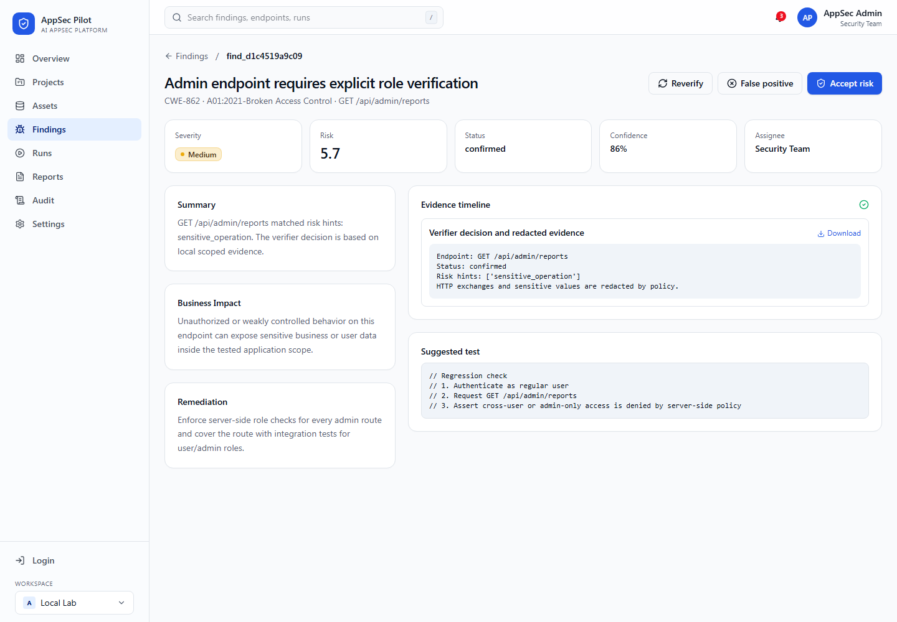
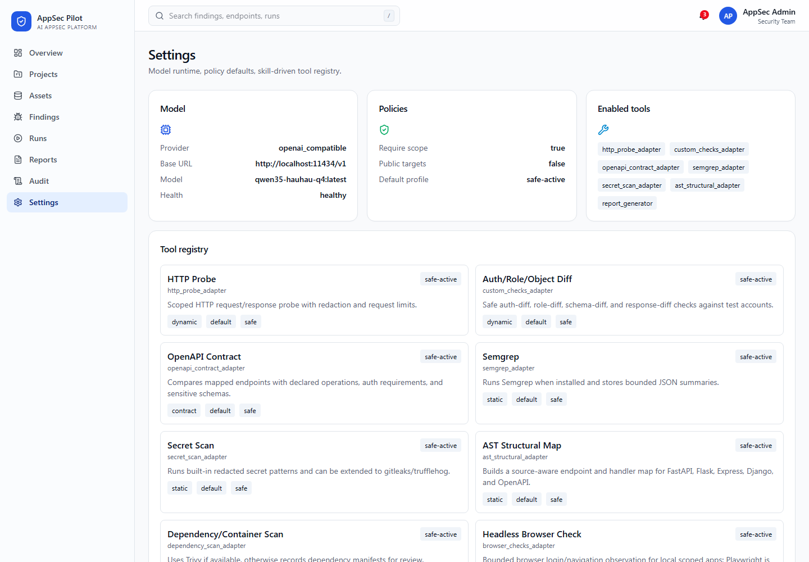

# AppSec Pilot

Self-hosted AI AppSec platform для авторизованной проверки web-приложений и API. Проект строит карту endpoint-ов, выбирает безопасные проверки через skill/tool registry, валидирует findings по evidence и выпускает отчеты для разработчиков и CI.



## Что реализовано

- FastAPI backend: JWT auth, RBAC, projects, targets, scans, endpoints, findings, evidence, reports, settings, audit log.
- React UI на Vite/TanStack: dashboard, projects, target setup, scan timeline, endpoint graph, findings, reports, settings/model/tools, audit log.
- Agent runtime: scope policy, endpoint mapper, prompt layer, skill catalog, tool registry, verifier, risk scorer, evidence redaction.
- Endpoint mapping: OpenAPI, FastAPI, Flask, Express, basic Django URL maps.
- Safe adapters: HTTP probe, auth/role/object diff, OpenAPI contract, Semgrep, secret scan, AST structural map, dependency inventory, ZAP baseline extension point, bounded browser checks.
- CLI `appsec`: `init`, `scan`, `status`, `findings`, `report`, `ci` with CI exit codes.
- Reports: HTML/PDF, reproduction summary, verifier decision, remediation, redacted evidence, CI decision.
- Demo lab: custom vulnerable FastAPI app plus scope files for local labs.
- Архитектура как код через LikeC4: `architecture/appsec-pilot.c4`.

## Архитектура

LikeC4 модель лежит в `architecture/appsec-pilot.c4`, статическая сборка — в `architecture/dist`, экспортированные схемы — в `docs/assets/architecture`.


Runtime agent view:



## Быстрый запуск на удаленном ПК

```powershell
cd C:\Users\maksi\Documents\work\appsec-pilot
uv venv .venv
uv pip install -e agent -e backend -e cli
cd frontend
npm install
```

Backend:

```powershell
cd C:\Users\maksi\Documents\work\appsec-pilot\backend
..\.venv\Scripts\python.exe -m uvicorn app.main:app --host 0.0.0.0 --port 8080
```

Frontend:

```powershell
cd C:\Users\maksi\Documents\work\appsec-pilot\frontend
npm run dev -- --host 0.0.0.0 --port 3001
```

Открыть UI: `http://10.78.211.199:3001`.

Demo login:

```text
admin@appsec.local
AppSecPilot123!
```

## Local model runtime

Backend ожидает OpenAI-compatible chat API. Для текущей машины настройки по умолчанию:

```env
LLM_PROVIDER=openai_compatible
LLM_BASE_URL=http://localhost:11434/v1
LLM_MODEL=qwen35-hauhau-q4:latest
LLM_API_KEY=local-dev-key
USE_LLM_PLANNER=false
```

Модель используется как planner/summarizer, но действия не выполняются напрямую из model output. Все проверки проходят через scope policy, tool registry, audit log, redaction и verifier. По умолчанию включен deterministic planner, чтобы MVP стабильно работал даже если локальная модель отвечает слишком многословно.

## Основной demo flow

1. Войти в UI.
2. Открыть **Projects** и выбрать `FastAPI Lab Demo`.
3. Проверить target и scope.
4. Запустить scan в профиле `safe-active`.
5. Открыть scan detail и проверить timeline, endpoint graph и findings.
6. Открыть finding detail, evidence и remediation.
7. Скачать HTML/PDF report.
8. Проверить CI gate через CLI.





## CLI

```powershell
appsec scan --api-url http://localhost:8080 --base-url http://localhost:8008 --scope benchmarks/custom_vuln_apps/fastapi_vuln/scope.yaml --wait --fail-on high
```

Exit codes:

- `0`: scan completed and policy gate passed;
- `1`: findings reached `--fail-on` threshold;
- `2`: scan failed;
- `3`: API/auth/config error;
- `4`: timeout;
- `5`: invalid CLI usage or unsupported mode.

## Tool registry и prompts

Prompt layer, skill catalog и tool registry описаны в коде:

- `agent/appsec_agent/llm/prompts.py`;
- `agent/appsec_agent/skills/catalog.py`;
- `agent/appsec_agent/tools/registry.py`.

В UI это видно на Settings screen:



## Документация на русском

- [Архитектура](docs/ru/architecture.md)
- [Руководство пользователя](docs/ru/user_guide.md)
- [Руководство оператора](docs/ru/operator_guide.md)
- [Модель безопасности](docs/ru/security_model.md)
- [Инструменты, навыки и prompt layer](docs/ru/tools_and_prompts.md)
- [Скриншоты интерфейса](docs/ru/screenshots.md)

## GitHub Pages (frontend demo для жюри)

Для жюри деплоится тот же `frontend`, но в `demo mode`:

- без подключения к backend и локальной модели;
- данные подаются из встроенного mock API;
- маршруты и экраны совпадают с основным интерфейсом.

Автодеплой настроен через `.github/workflows/pages.yml`, сборка идет из `frontend/dist/client`.

Публичный URL:

- `https://maksos1.github.io/Appsec_pilot/`

Если GitHub Pages еще не включены:
`Settings -> Pages -> Source: GitHub Actions`.

## Проверки

```powershell
cd C:\Users\maksi\Documents\work\appsec-pilot
.\.venv\Scripts\python.exe -m pytest agent backend cli -q
.\.venv\Scripts\python.exe -m ruff check agent backend cli
cd frontend
npm run build
npm run lint
cd ..\architecture
npm run validate
npm run build
```

UI screenshots обновляются headless Edge, без Playwright.

## Docker и lab режим

Когда Docker Desktop доступен:

```powershell
docker compose up -d --build
docker compose -f docker-compose.lab.yml up -d
```

Lab compose включает custom FastAPI vulnerable app и scope-файлы для внешних учебных targets. Если Docker daemon не запущен из SSH-сессии, backend/frontend/CLI остаются рабочими в local dev режиме, а lab compose нужно запускать после старта Docker Desktop.

## Safety

AppSec Pilot рассчитан на authorized security validation. Scope file обязателен, public targets отключены по умолчанию, destructive checks не подключены, evidence редактируется, все scan events пишутся в audit log.
