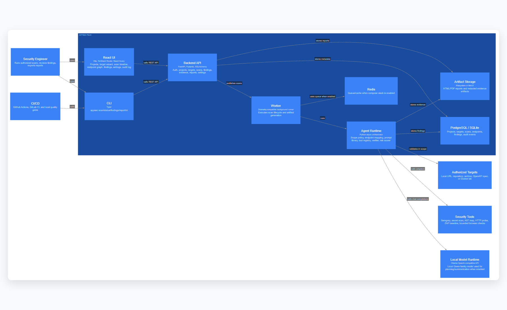

# Архитектура AppSec Pilot

Архитектура описана как код в `architecture/appsec-pilot.c4` и собирается через LikeC4. Главная идея: UI, CLI и CI ходят в единый backend API, backend запускает scan lifecycle, а agent runtime выполняет только проверки, разрешенные scope policy.

## Основные компоненты

- **React UI**: рабочий интерфейс для проектов, целей, сканов, findings, reports, settings и audit log.
- **CLI**: CI-friendly команды `appsec scan`, `status`, `findings`, `report`, `ci`.
- **Backend API**: авторизация, RBAC, проекты, цели, сканы, evidence, reports и audit events.
- **Agent Runtime**: endpoint mapper, skill catalog, prompt layer, tool registry, verifier, risk scorer.
- **Sandbox Policy**: allowlist целей, request limits, запрет destructive checks, redaction evidence.
- **Local Model Runtime**: OpenAI-compatible endpoint локальной Qwen-family модели. По умолчанию детерминированный planner включен как fallback, чтобы сканы не зависали из-за verbose model output.

## Поток скана

1. Пользователь создает target и scope.
2. Backend валидирует scope и создает scan run.
3. Agent строит карту endpoint-ов через OpenAPI/source/live mapping.
4. Planner выбирает skill cards и tool adapters.
5. Tool adapters выполняют безопасные проверки.
6. Verifier принимает решение `confirmed`, `needs_review` или `false_positive` только по evidence.
7. Report generator создает HTML/PDF и CI decision.
