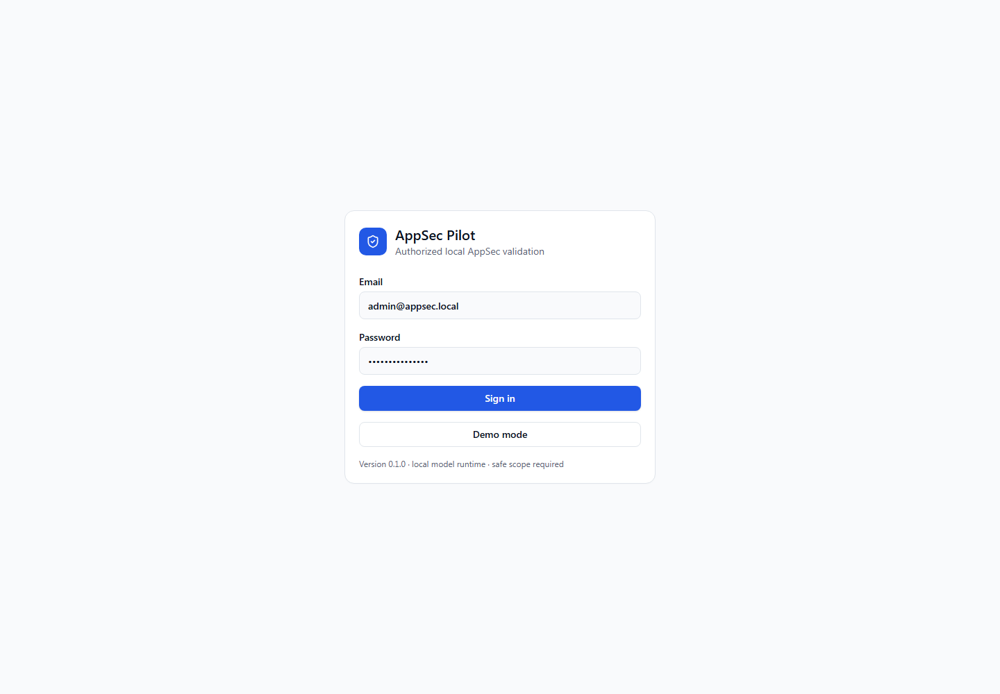
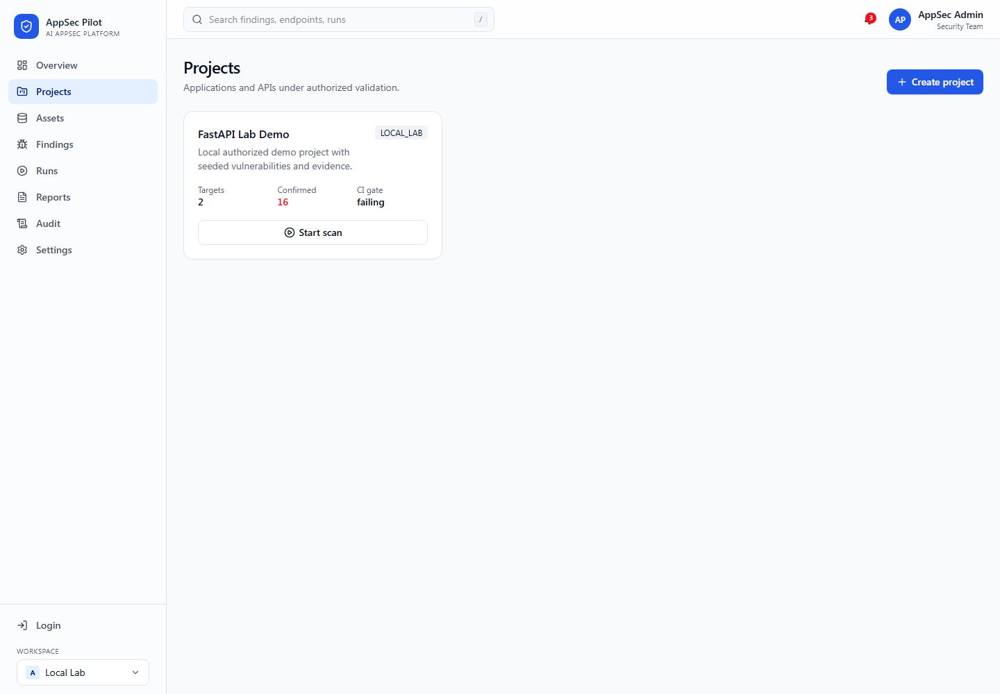
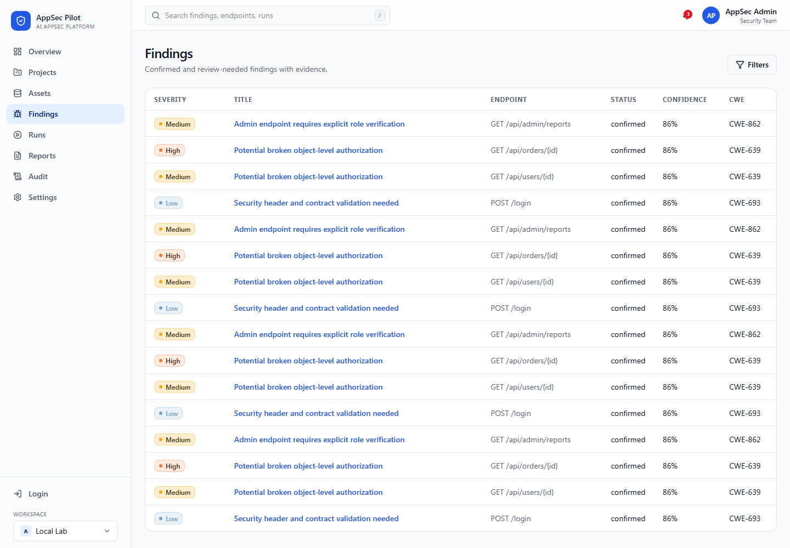

# Руководство пользователя

## Вход

Откройте `http://10.78.211.199:3001` и войдите под demo-аккаунтом:

```text
admin@appsec.local
AppSecPilot123!
```



## Основной сценарий

1. Откройте **Projects** и выберите demo-проект.
2. Проверьте target и scope policy.
3. Запустите scan в профиле `safe-active`.
4. Откройте scan detail и дождитесь статуса `completed`.
5. Перейдите в findings, проверьте evidence и remediation.
6. Скачайте HTML/PDF report.







## Что считается рабочим результатом

- scan завершился без `failed_reason`;
- endpoints отображаются в scan detail;
- findings имеют severity, status, evidence и remediation;
- reports доступны для скачивания;
- audit log показывает ключевые действия.
